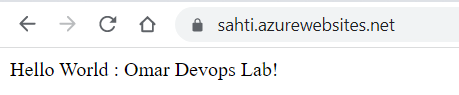

<p align="center">
  <a href="http://nestjs.com/" target="blank"></a>
</p>

[circleci-image]: https://img.shields.io/circleci/build/github/nestjs/nest/master?token=abc123def456
[circleci-url]: https://circleci.com/gh/nestjs/nest

  <p align="center">A progressive <a href="http://nodejs.org" target="_blank">Node.js</a> framework for building efficient and scalable server-side applications.</p>
    <p align="center">
<a href="https://www.npmjs.com/~nestjscore" target="_blank"></a>
<a href="https://www.npmjs.com/~nestjscore" target="_blank"></a>
<a href="https://www.npmjs.com/~nestjscore" target="_blank"></a>
<a href="https://circleci.com/gh/nestjs/nest" target="_blank"></a>
<a href="https://coveralls.io/github/nestjs/nest?branch=master" target="_blank"></a>
<a href="https://discord.gg/G7Qnnhy" target="_blank"></a>
<a href="https://opencollective.com/nest#backer" target="_blank"></a>
<a href="https://opencollective.com/nest#sponsor" target="_blank"></a>
  <a href="https://paypal.me/kamilmysliwiec" target="_blank"></a>
    <a href="https://opencollective.com/nest#sponsor"  target="_blank"></a>
  <a href="https://twitter.com/nestframework" target="_blank"></a>
</p>
  <!--[](https://opencollective.com/nest#backer)
  [](https://opencollective.com/nest#sponsor)-->

## DevOps pipeline project
In this project I used 
- github actions for the ci workflow
- azure container registry
- azure app service for continuous delivery
 - Deployment website link
 `https://sahti.azurewebsites.net/`
## Pipeline explained
- building project and running tests
```yaml
      - run: npm install
      - run: npm install -g dotenv-cli
      - run: npm run test
```
-building docker image and push to azure CR

```yaml
      - uses: azure/docker-login@v1
        with:
          login-server: sahti.azurecr.io
          username: ${{ secrets.REGISTRY_USERNAME }}
          password: ${{ secrets.REGISTRY_PASSWORD }}

      - run: |
          docker build . -t sahti.azurecr.io/shati:${{ github.sha }}
          docker image ls
          docker push sahti.azurecr.io/shati:${{ github.sha }}
```
- deploy the new version to azure webapp


```yaml
           - uses: azure/webapps-deploy@v2
             with:
               app-name: 'sahti'
               publish-profile: ${{ secrets.AZURE_WEBAPP_PUBLISH_PROFILE }}
               images: 'sahti.azurecr.io/sahti:${{ github.sha }}'
```

- finally we can see the response updated after the latest push


- azure app service config

- azure app service scale out and deployment slot config


***azure web app name is sahti because the initial plan was about mixing the test & devops labs
but some problem occurred so I migrate the pipeline to this dummy project which does not affect it functionality***

## Actions Screenshots


## Installation

```bash
$ npm install
```

## Running the app

```bash
# development
$ npm run start

# watch mode
$ npm run start:dev

# production mode
$ npm run start:prod
```

## Test

```bash
# unit tests
$ npm run test

# e2e tests
$ npm run test:e2e

# test coverage
$ npm run test:cov
```


## License

Nest is [MIT licensed](LICENSE).
